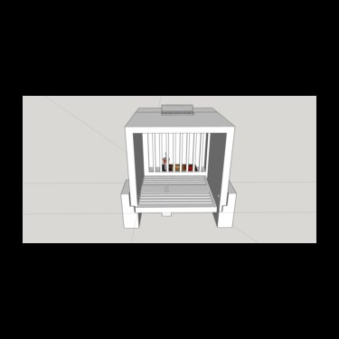

### Dual mouse feeding and body-weight monitor 

* Small 3d-printed container placed in animal homecage that can be downloaded [here](https://github.com/sronilsson/3D_designs/tree/master/dual-feeding-bw-monitor).
* Designed for holding two independent [load cells](https://www.amazon.com/dp/B076P8G8B6/ref=cm_sw_r_tw_dp_U_x_pFM.Db08M0R2R).
* Gives data every 2.5-5s on animal weight and feeding patterns with 0.01g-0.1g resolution. Gives reliable curves for consumed food if using bin sizes of around 2min.
* Tested with Arduino Uno/Mega's and the [HX711 library](https://www.arduinolibraries.info/libraries/hx711-arduino-library) and [PySerial](https://pypi.org/project/pyserial/).

 

 