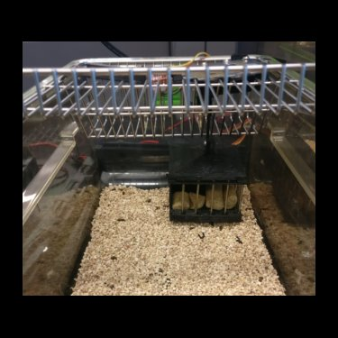

### Homecage basket meassuring food intake

* Accurate recordings of feeding-bout times / feeding frequency / feeding amount at 0.01g resolution
* For stable reliable readings, I recommend taking taking median readings of every 250-500 serial port prints (gives one weight reading every 2.5-5s).
* Designed for a single [load cell](https://www.amazon.com/dp/B076P8G8B6/ref=cm_sw_r_tw_dp_U_x_pFM.Db08M0R2R).
* Tested with Arduino Uno/Mega's and the [HX711 library](https://www.arduinolibraries.info/libraries/hx711-arduino-library) and [PySerial](https://pypi.org/project/pyserial/).

 
