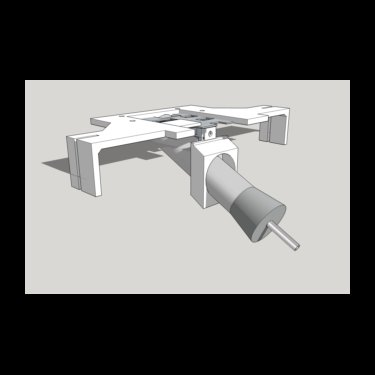
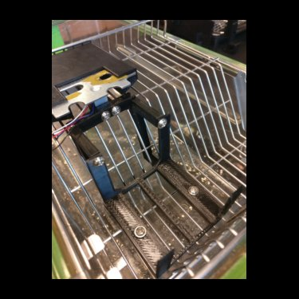
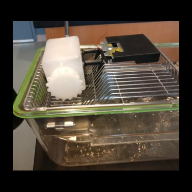

#### Home cage liquid intake monitoring 
* Uses a load cell from a [scale](https://www.amazon.com/dp/B07SL2TBBD/ref=cm_sw_r_tw_dp_U_x_jRM.DbHEXEM0S) connected to a [HX711](https://www.sparkfun.com/products/13879) amplifier to measure liquid intake over [PySerial](https://pypi.org/project/pyserial/)

 
 
