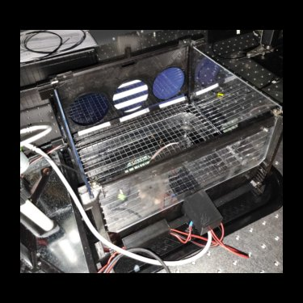

### 3D-printed 'touchscreen' operant box
* Animals respond with [capacitance touch](https://playground.arduino.cc/Main/CapacitiveSensor/) at three response locations. 
* Animals are monitored through the tablet camera and [Flask](https://github.com/miguelgrinberg/flask-video-streaming/tree/v1)
* Liquid delivery port with [IR entry detector](https://www.verical.com/datasheet/adafruit-photoelectric-sensor-2167-2128562.pdf).
* Rewards delivered with [12V peristaltic liquid pump](https://www.amazon.com/dp/B0799DKLZ3/ref=cm_sw_r_tw_dp_U_x_Ja5.Db50ZB94D).
* Arduino script controls pump, and detects IR breaks, and capacitance touch responses. 

 
 
 
 

